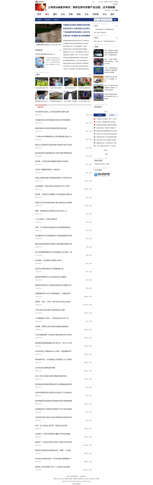

# <font color=#b22222>Python爬虫简教---爬取搜狐新闻</font>

<font color=#a52a2a>**background:** 小姐姐准备开课啦,预热预热:)</font>

## <font color=black>示例 1:</font>

该例中我们将要爬取搜狐新闻的 **新闻标题**, **发布时间**, **新闻链接**, 并保存为excel文件.  

我们要爬取的新闻页面如下:



导入**BeautifulSoup**, 如果还未安装**bs4**,请用如下命令进行安装:  
**pip install bs4**  


```python
from bs4 import BeautifulSoup
```

导入**requests**


```python
import requests
```

我们要爬取的搜狐新闻页面url是 http://news.sina.com.cn/china/


```python
url = 'http://news.sina.com.cn/china/'
```

获取网页页面数据


```python
web_content = requests.get(url)
bs = BeautifulSoup(web_content.text,'lxml')
```

我们来打印下页面内容,看看是什么


```python
print(bs)
```

发现页面内容有乱码啊,为什么呢,因为网页内容的编码是**utf-8**, 这个从页面开头的内容可以看出来  

`<meta content="text/html; charset=utf-8" http-equiv="Content-type"/>`

所以我们需要在获取网页数据后指定下网页数据编码,代码如下:


```python
web_content.encoding='utf-8'
bs = BeautifulSoup(web_content.text,'lxml')
```

再来打印下内容看看:


```python
print(bs)
```

接下来解析出网页中我们需要的内容.  

在解析我们需要的内容前,我们需要观察下前面打印的网页数据,发现我们需要的新闻数据的 **class** 属性是 **"news-item"**,我们需要找出所有class属性是news-item的元素,代码如下,取class属性时需要加'.':


```python
news_items = bs.select('.news-item')
```

打印第一个元素看看是什么:


```python
news_items[0]
```


    <div class="news-item first-news-item ">
    <h2><a href="http://news.sina.com.cn/c/2018-07-14/doc-ihfhfwmv2843795.shtml" suda-uatrack="key=newschina_index_2014&amp;value=news_link_1" target="_blank">杨洁篪：半岛核问题正朝着政治解决方向前进</a></h2>
    <div class="info clearfix ">
    <div class="time">7月14日 11:53</div>
    <div class="action"><a data-id="gn:comos-hfhfwmv2843795:0" href="http://comment5.news.sina.com.cn/comment/skin/default.html?channel=gn&amp;newsid=comos-hfhfwmv2843795&amp;style=0" target="_blank">评论</a><span class="spliter">|</span><span class="bdshare_t bds_tools get-codes-bdshare" data="{text:'杨洁篪：半岛核问题正朝着政治解决方向前进',url:'http://news.sina.com.cn/c/2018-07-14/doc-ihfhfwmv2843795.shtml',pic:''}" id="bdshare"><span class="bds_more">分享</span></span></div>
    </div>
    </div>


所以对每个news_item我们具体需要取出的是标签为**h2**的元素(**新闻标题**),class属性为**time**的元素(**时间**),标签为**a**的元素(**新闻链接**),我们对第一个news测试看看:


```python
test_news_item = news_items[0]
news_title = test_news_item.select('h2')[0].text
news_time = news.select('.time')[0].text
news_link = news.select('a')[0]['href']
print(news_title+'\n'+news_time+'\n'+news_link)
```

    杨洁篪：半岛核问题正朝着政治解决方向前进
    1月22日 08:20
    http://news.sina.com.cn/c/sd/2018-01-22/doc-ifyquptv8499452.shtml


看起来结果没毛病,那就写个循环把每个news_item都解析出来吧,我们用**pandas**的**DateFrame**放数据结果,并保存.


```python
import pandas as pd
news_result = pd.DataFrame()
for i,news in enumerate(news_items):
    if(len(news.select('h2')) > 0):
        news_result.loc[i,'新闻标题'] = news.select('h2')[0].text
        news_result.loc[i,'发布时间'] =news.select('.time')[0].text
        news_result.loc[i,'新闻链接'] = news.select('a')[0]['href']
```


```python
news_result.head()
```


<div>
<style scoped>
    .dataframe tbody tr th:only-of-type {
        vertical-align: middle;
    }

    .dataframe tbody tr th {
        vertical-align: top;
    }

    .dataframe thead th {
        text-align: right;
    }
</style>
<table border="1" class="dataframe">
  <thead>
    <tr style="text-align: right;">
      <th></th>
      <th>新闻标题</th>
      <th>发布时间</th>
      <th>新闻链接</th>
    </tr>
  </thead>
  <tbody>
    <tr>
      <th>0</th>
      <td>杨洁篪：半岛核问题正朝着政治解决方向前进</td>
      <td>7月14日 11:53</td>
      <td>http://news.sina.com.cn/c/2018-07-14/doc-ihfhf...</td>
    </tr>
    <tr>
      <th>1</th>
      <td>北京这个重要机构新增一名副主任</td>
      <td>7月14日 11:44</td>
      <td>http://news.sina.com.cn/c/2018-07-14/doc-ihfhf...</td>
    </tr>
    <tr>
      <th>4</th>
      <td>长春公用局原纪委书记蔡晓时受贿197万获刑5年半</td>
      <td>7月14日 11:44</td>
      <td>http://news.sina.com.cn/c/2018-07-14/doc-ihfhf...</td>
    </tr>
    <tr>
      <th>5</th>
      <td>社科院报告：建议全国2030年起实行4天工作制</td>
      <td>7月14日 11:35</td>
      <td>http://news.sina.com.cn/c/2018-07-14/doc-ihfhf...</td>
    </tr>
    <tr>
      <th>6</th>
      <td>杨洁篪：贸易战不会有赢家 中方理当做出必要反击</td>
      <td>7月14日 11:30</td>
      <td>http://news.sina.com.cn/o/2018-07-14/doc-ihfhf...</td>
    </tr>
  </tbody>
</table>
</div>


```python
news_result.to_excel('搜狐新闻爬取结果.xlsx')
```
